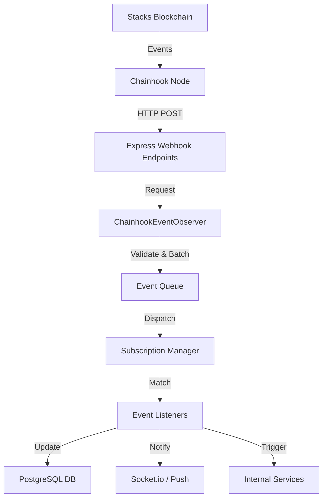

# Chainhook Integration Architecture

This document describes the comprehensive architecture of the Chainhook integration in PassportX, focusing on how blockchain events are monitored, processed, and integrated into the application state.

## Overview

PassportX uses Hiro's Chainhook to achieve real-time synchronization between the Stacks blockchain and the application backend. This allows for immediate UI updates, real-time notifications, and automated business logic execution based on on-chain events.

## Architecture Diagram

## Core Components

### 1. Chainhook Node
The external service provided by Hiro that monitors the Stacks blockchain for specific conditions (predicates) and sends HTTP requests to our backend when those conditions are met.

### 2. ChainhookEventObserver (`src/chainhook/`)
A centralized service in the backend that:
- Manages the lifecycle of event reception.
- Provides a unified interface for starting/stopping the observer.
- Handles security validation of incoming webhook requests.

### 3. ChainhookManager
Orchestrates the various sub-services:
- **SubscriptionManager**: Manages high-level application subscriptions to events.
- **PredicateManager**: Manages the low-level Chainhook predicates registered with the node.
- **HealthCheck**: Monitors connection status and processing latency.
- **Logger**: Provides detailed audit trails of all event processing.

## Access Control Monitoring

A critical part of the system is monitoring the `access-control` contract. The following predicates are defined in `backend/src/config/accessControlPredicates.ts`:

| Event | Predicate UUID | Contract Method | Webhook Endpoint |
|-------|----------------|-----------------|------------------|
| Global Permission Set | `pred_access_control_global_permission` | `set-global-permissions` | `/access-control/webhook/global-permission` |
| Community Permission Set | `pred_access_control_community_permission` | `set-community-permissions` | `/access-control/webhook/community-permission` |
| User Suspension | `pred_access_control_user_suspension` | `suspend-user` | `/access-control/webhook/user-suspended` |
| User Unsuspension | `pred_access_control_user_unsuspension` | `unsuspend-user` | `/access-control/webhook/user-unsuspended` |
| Issuer Authorization | `pred_access_control_issuer_authorized` | `authorize-issuer` | `/access-control/webhook/issuer-authorized` |
| Issuer Revocation | `pred_access_control_issuer_revoked` | `revoke-issuer` | `/access-control/webhook/issuer-revoked` |
| Permission Group Created | `pred_access_control_permission_group_created` | `create-permission-group` | `/access-control/webhook/permission-group-created` |

## Event Lifecycle

1. **Predicate Registration**: During system startup, `PredicateManager` ensures all required predicates are registered with the Chainhook node.
2. **Event Arrival**: Chainhook node sends an HTTP POST request to the configured webhook URL.
3. **Validation**: The `ChainhookEventObserver` validates the payload and authorization token.
4. **Queueing**: Events are added to an internal queue to prevent blocking the HTTP response.
5. **Processing**: The `SubscriptionManager` identifies active listeners for the event type.
6. **Execution**: Listeners execute business logic (e.g., updating user permissions in the DB).
7. **Confirmation**: Once processed, the event is marked as completed in the logs.

## Downstream Event Handlers

Once an event is dispatched by the `SubscriptionManager`, it is processed by specialized handlers that update the application state:

### Access Control Handler (`AccessControlEventHandler.ts`)
Processes security-sensitive events to maintain synchronization between on-chain roles and the database:
- **Admin Management**: Updates `Community` and `User` models when admins are added or removed on-chain.
- **Ownership Transfers**: Updates community ownership records and administrative permissions.
- **Security Monitoring**: Logs suspensions and permission changes to the `AccessControlAuditService`.

### Notification Services
Specific services listen for events to trigger user-facing notifications:
- `badgeMintNotificationService.ts`: Notifies users when they receive a new badge.
- `communityCreationNotificationService.ts`: Alerts relevant parties about new community formation.
- `badgeRevocationNotificationService.ts`: Handles alerts for badge revocations.

## Reliability and Resilience

### Reorg Handling
Chainhook provides information about block reorganizations. Our system:
- Detects `reorg` flags in the payload.
- Can rollback state changes if a block is discarded.
- Uses `CHAINHOOK_START_BLOCK` to replay missed events during downtime.

### Error Recovery
- **Exponential Backoff**: Automatic reconnection to the Chainhook node if the connection is lost.
- **Health Monitoring**: Real-time monitoring of event processing success rates.
- **Dead Letter Queue**: Events that fail processing after multiple retries are logged for manual intervention.

## Configuration

Settings are managed via environment variables:
- `CHAINHOOK_NODE_URL`: URL of the Hiro Chainhook node.
- `CHAINHOOK_SERVER_PORT`: Port where the local webhook server listens.
- `CHAINHOOK_AUTH_TOKEN`: Shared secret for authenticating webhook requests.

## Related Documentation

- [Chainhook Setup Guide](../CHAINHOOK_SETUP.md)
- [Event Observer Reference](./CHAINHOOK_EVENT_OBSERVER.md)
- [Testing Guide](./chainhook-testing-guide.md)
