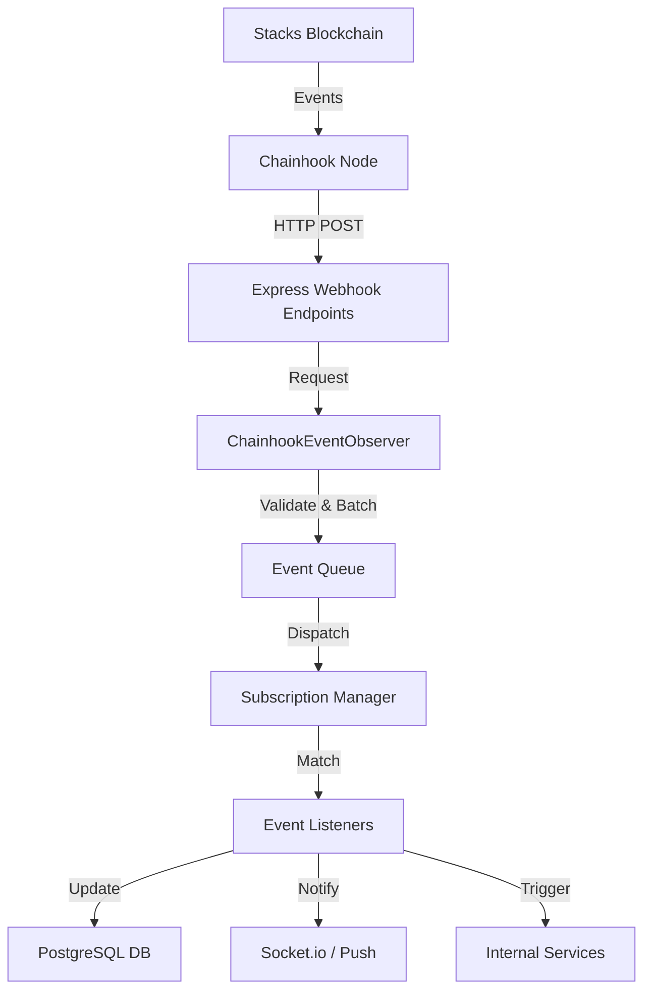

# Chainhook Integration Architecture

This document describes the comprehensive architecture of the Chainhook integration in PassportX.

## Overview

PassportX uses Hiro's Chainhook to achieve real-time synchronization between the Stacks blockchain and the application backend.

## Architecture Diagram

## Core Components

### 1. Chainhook Node
The external service provided by Hiro that monitors the Stacks blockchain for specific conditions (predicates).

### 2. ChainhookEventObserver (`src/chainhook/`)
A centralized service in the backend that manages the lifecycle of event reception.

### 3. ChainhookManager
Orchestrates various sub-services like SubscriptionManager and PredicateManager.

## Access Control Monitoring

A critical part of the system is monitoring the `access-control` contract for permissions.

## Event Lifecycle

1. Predicate Registration
2. Event Arrival
3. Validation
4. Queueing
5. Processing
6. Execution
7. Confirmation

## Reliability and Resilience

### Reorg Handling
Chainhook provides information about block reorganizations.

## Downstream Event Handlers

Specialized handlers like AccessControlEventHandler update the application state.

## Configuration

Settings are managed via environment variables like CHAINHOOK_NODE_URL and CHAINHOOK_SERVER_PORT.
