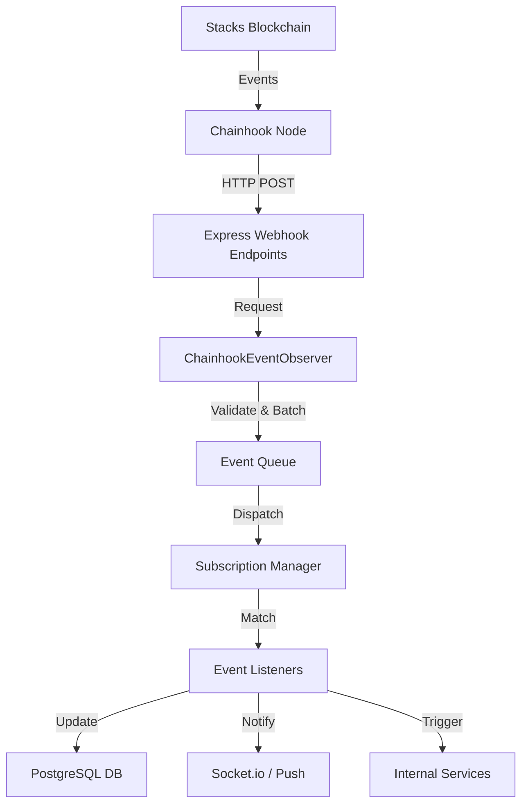

# Chainhook Integration Architecture

This document describes the comprehensive architecture of the Chainhook integration in PassportX.

## Overview

PassportX uses Hiro's Chainhook to achieve real-time synchronization between the Stacks blockchain and the application backend.

## Architecture Diagram

## Core Components

### 1. Chainhook Node
The external service provided by Hiro that monitors the Stacks blockchain for specific conditions (predicates).

### 2. ChainhookEventObserver (`src/chainhook/`)
A centralized service in the backend that manages the lifecycle of event reception.
