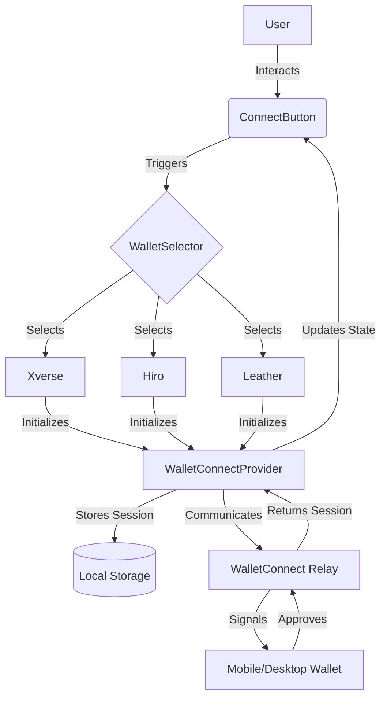

# WalletConnect Integration Guide

Comprehensive documentation for integrating WalletConnect into the PassportX ecosystem.

## Overview

WalletConnect is a decentralized protocol for connecting dApps to mobile wallets with QR code scanning or deep linking. In PassportX, WalletConnect is primarily used to:

-   Connect Stacks wallets (Xverse, Hiro, Leather)
-   Sign transactions securely without exposing private keys
-   Verify account ownership
-   Handle session persistence across browser refreshes

This guide provides everything you need to know to set up, use, and maintain the WalletConnect integration.

## Architecture

The integration follows a provider-consumer pattern using React Context for state management.

### Core Components

1.  **`WalletConnectProvider`**: Located in `src/contexts/WalletConnectContext.tsx`. It manages the lifecycle of the WalletConnect session, including initialization, connection, disconnection, and session restoration.
2.  **`ConnectButton`**: A reusable UI component that displays the connection status and triggers the connection modal.
3.  **`WalletSelector`**: A modal component that allows users to choose their preferred Stacks wallet or scan a QR code.
4.  **`WalletConnectAnalytics`**: Tracks connection success rates, common errors, and wallet popularity.

