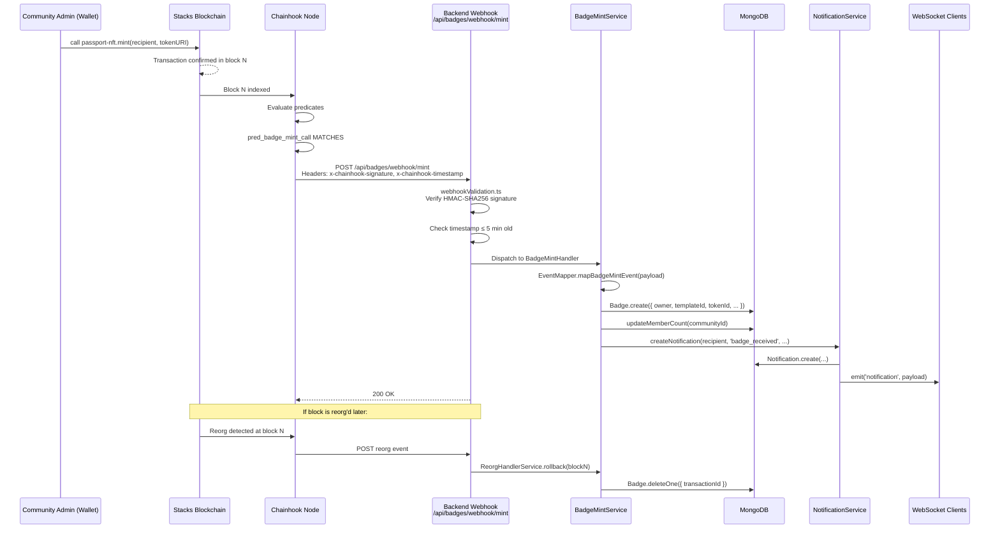
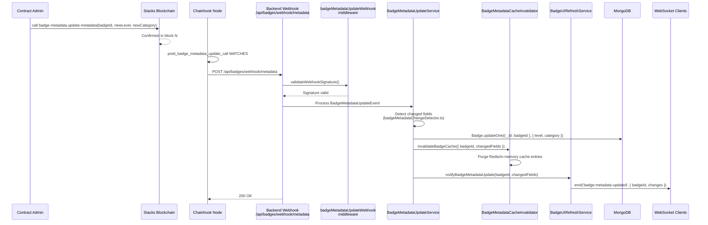
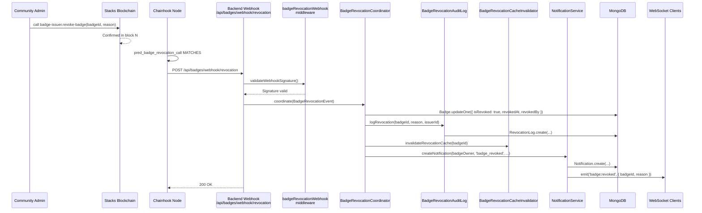
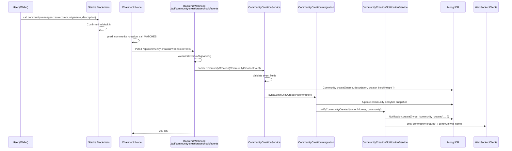
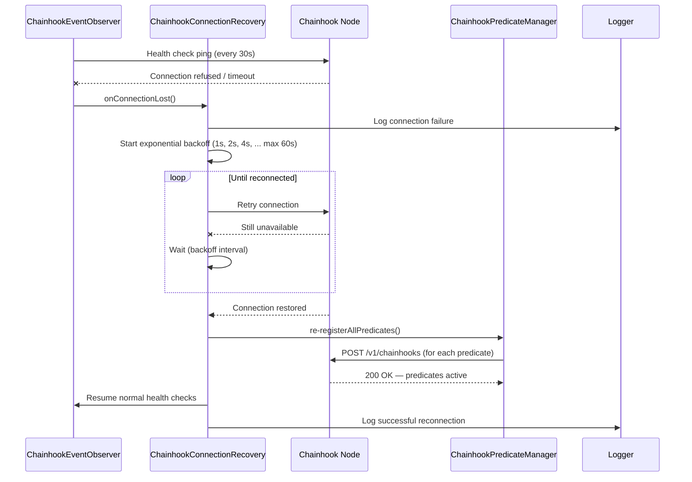
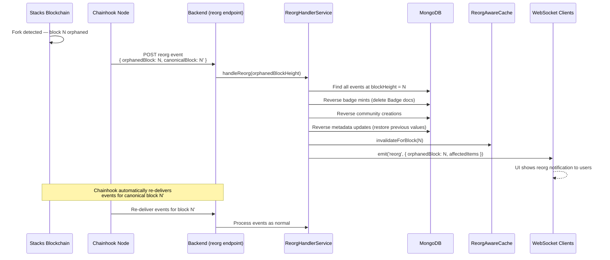

# Chainhook Sequence Diagrams

Mermaid sequence diagrams for each PassportX on-chain event. These diagrams
render natively on GitHub. Use them to understand exactly what happens at each
step of event processing and where to look when something breaks.

---

## 1. Badge Mint

A community admin calls `mint` on the `passport-nft` contract.

---

## 2. Badge Metadata Update

A contract admin calls `update-metadata` on the `badge-metadata` contract.

---

## 3. Badge Revocation

A community admin calls `revoke-badge` on the `badge-issuer` contract.

---

## 4. Community Creation

Anyone calls `create-community` on the `community-manager` contract.

---

## 5. Chainhook Node Connection Recovery

What happens when the Chainhook node becomes unavailable.

---

## 6. Reorg Handling

When a chain reorganisation orphans a previously confirmed block.

---

## Summary Table

| Event | Predicate | Webhook Route | Key Service |
|---|---|---|---|
| Badge mint | `pred_badge_mint_call` | `/api/badges/webhook/mint` | `BadgeMintService` |
| Badge metadata update | `pred_badge_metadata_update_call` | `/api/badges/webhook/metadata` | `BadgeMetadataUpdateService` |
| Badge revocation | `pred_badge_revocation_call` | `/api/badges/webhook/revocation` | `BadgeRevocationCoordinator` |
| Community creation | `pred_community_creation_call` | `/api/community-creation/webhook/events` | `CommunityCreationService` |

---

## See Also

- [Architecture Overview](./ARCHITECTURE.md)
- [Predicate Flow](./PREDICATE_FLOW.md)
- [Troubleshooting Guide](./TROUBLESHOOTING.md)
- [Configuration Reference](./CONFIGURATION.md)
